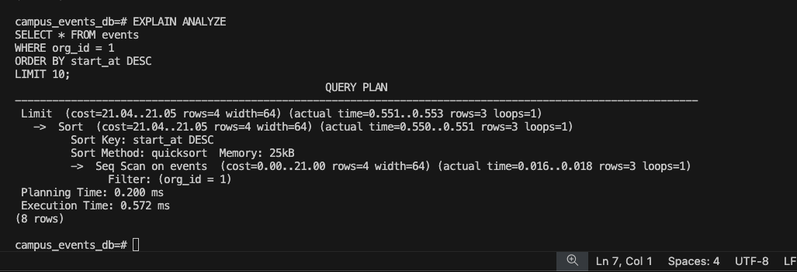
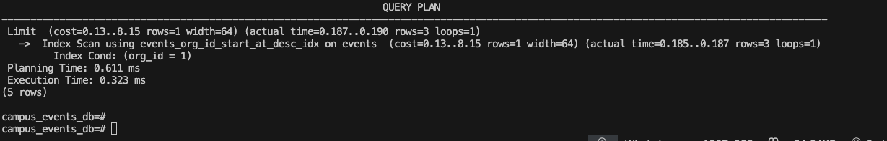

# Campus Events & Ticketing Web Application

## Project Description
This project is a **Campus Events & Ticketing Web Application** designed to help students discover, organize, and attend events on campus.  

The system will allow:
- **Students** to browse events, save them, claim tickets (free/paid), and check in via QR codes.  
- **Organizers** to create/manage events, track attendance, and view analytics dashboards.  
- **Administrators** to moderate content, approve organizers, and access global statistics.  

The application streamlines event management, improves student engagement, and provides insights for both organizers and campus administration.  
> Example reference: [CampusGroups](https://www.campusgroups.com)

---

## Objectives
- Gain hands-on experience with Agile development (Scrum).  
- Practice version control, collaboration, and project management using GitHub.  
- Deliver a **middle-fidelity prototype** of the platform within 10 weeks.  

---

## Core Features
1. **Student Event Experience**  
   - Event discovery with filters (date, category, organization).  
   - Save events, claim tickets, and receive digital QR codes.  

2. **Organizer Event Management**  
   - Event creation & management.  
   - Event analytics dashboard and CSV export.  
   - QR code validation for check-in.  

3. **Administrator Dashboard & Moderation**  
   - Approve organizer accounts and moderate events.  
   - Global analytics and organization management.  

4. **Additional Feature (TBD)**  
   - TBD

---

## Team Members
| Name               | Student Number | GitHub Username   |
| ------------------ | -------------- | ----------------- |
| Mandeep Singh      | 40289772       | @msingh13         |
| Yazan Al Lahham    | 40237739       | @555yazan         |
| Nabil Khan         | 40284257       | @nabnab00         |
| Michael Santella   | 40264501       | @reflexzone13     |
| Giuseppe Ippolito  | 40315749       | @Ippolito4        |
| Juliano Di Michele | 40282584       | @JulianoDiMichele |
| Karim Mellouk      | 40315111       | @KarimDsama       |

---

## Languages & Technologies
- **Frontend:** React (Vite)  
- **Backend:** Node.js (Express)  
- **Database:** PostgreSQL  
- **Version Control:** GitHub  
- **Agile Tools:** GitHub Issues, Projects, Wiki, and Actions (CI/CD)  

---

## Agile Process
- Following **Scrum methodology** with 4 sprints (~3 weeks each).  
- **Sprint 1 Deliverables**:
  - GitHub repo setup and initialization.  
  - README with description, objectives, features, team info, and tech stack.   
  - User stories (`US.##`) and tasks (`Task-##`) in GitHub Issues.  
  - Meeting minutes in `/docs/meetings`.  
  - Contribution logs in `/docs/logs`.  

---

## References
- [Design Mockup Fidelity](https://www.webfx.com/blog/web-design/design-mockup-fidelity/)  
- [Wireframes vs. Prototypes](https://www.webfx.com/blog/web-design/wireframes-vs-prototypes-difference/)  
- [CampusGroups](https://www.campusgroups.com)  


## Event Index Performance Analysis

We added two indexes:
- `idx_events_org_id` on events(org_id)
- `idx_events_start_desc` on events(start_at DESC)

### Query plan
The following query shows an `Index Scan` was used:

### Query plan
The following query shows an `Index Scan` was used:

```sql
EXPLAIN ANALYZE
SELECT * FROM events
WHERE org_id = 1
ORDER BY start_at DESC
LIMIT 10;
```





