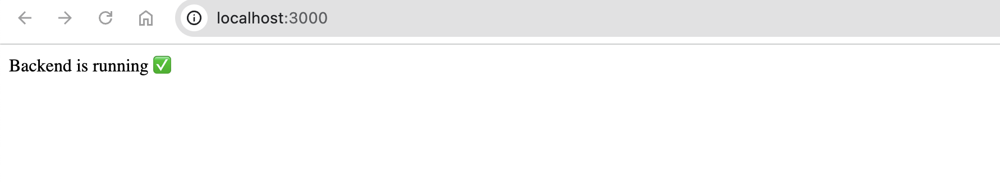
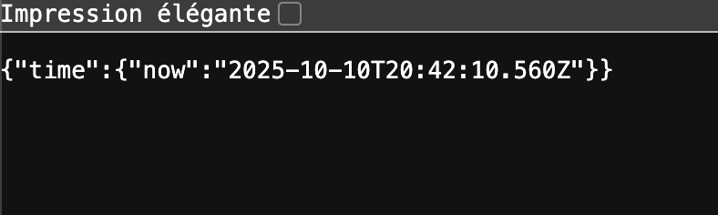

# Contribution Log – Sprint 1 – Karim Mellouk

| Date       | Task/Activity          | Time Spent | Notes                                                        |
|------------|------------------------|------------|--------------------------------------------------------------|
| 2025-09-18 | Cloned repo and setup  | 1h         | Configured branch and local environment                      |
| 2025-09-20 | Team meeting #1        | 1h         | Discussed backlog and role assignments                       |
| 2025-09-21 | Edited documentation   | 1h         | Added details to README                                      |
| 2025-09-23 | Team meeting #2        | 2h         | Discussed sprint 1                                           |
| 2025-09-24 | Creation of task       | 1h         | Discussed about task creation                                |
| 2025-09-24 | User stories           | 1h         | Break the story down into sub tasks                          |
| 2025-09-25 | Meeting #3             | 1h         | Separated Sprint 2 tasks (each member: 2x FE, 2x BE, 2x DB, 2x QA) |
| 2025-09-25 | Updated contribution   | 0.5h       | Noted blockers (ex: repo setup conf)                         |

---

### Minor Issues / Challenges
- Faced minor Git setup/config blockers when creating new branch.  
- Some confusion with old branch deletions, resolved by recreating personal branch.  
- Some merge conflicts.  

---

## STU-4 — Backend and Database Connection Setup  
**Date:** October 10, 2025  
**Objective:** Setup Express backend and connect to PostgreSQL database.

### Steps Completed
1. Installed Express and pg  
2. Configured PostgreSQL Pool (user: karim, db: campus_events)  
3. Added routes `/` and `/db-test`  
4. Verified connection via browser  

### Evidence
- Screenshot of backend running ✅  
  

- Screenshot of db-test JSON ✅  
  

### Result
Backend and DB connection confirmed working. Ready for STU-5.
